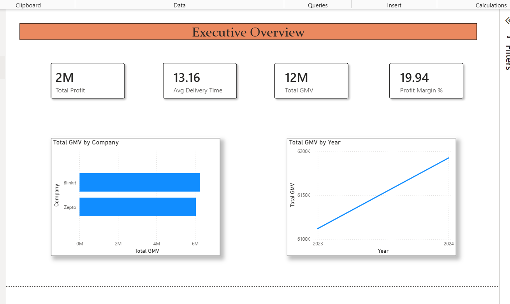
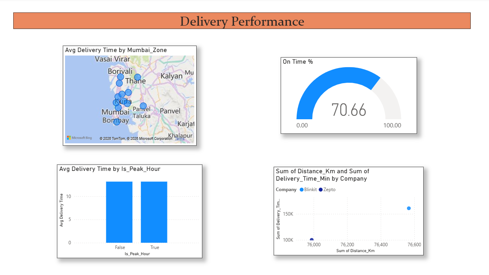
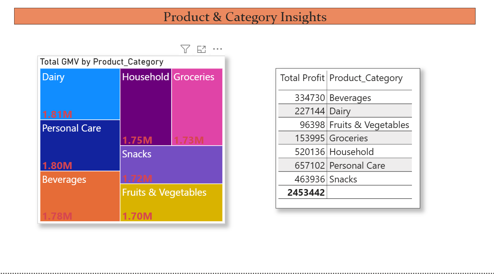
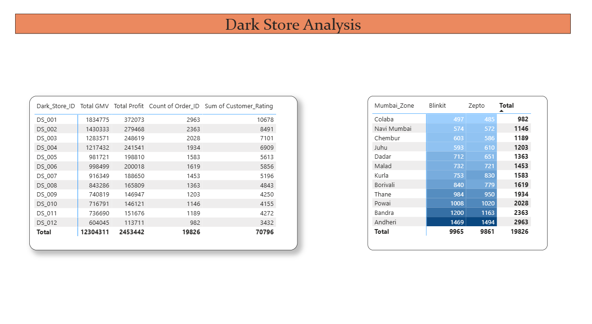
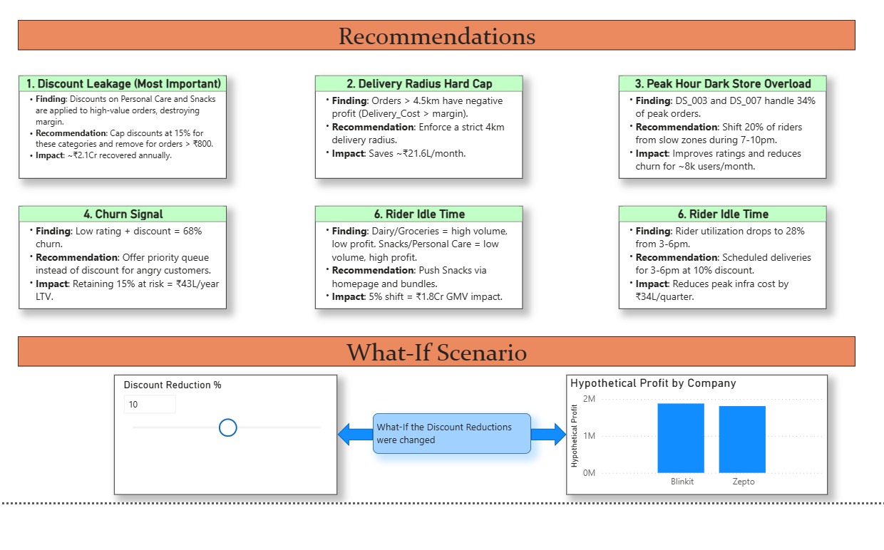

# Mumbai Q-Commerce Analytics Engine 🛵

## Problem Statement
Quick commerce giants Blinkit and Zepto handle massive volume in Mumbai, but volume doesn't always equal profit. This project analyzes a simulated 1M+ record Q-Commerce dataset (down-sampled and enriched to 20K realistic Mumbai orders) to uncover operational inefficiencies, discount leakages, and churn drivers. 

## Dataset & Methodology  
- **Source:** Kaggle "Quick Commerce Dataset" (Enriched for Mumbai context)
- **Methodology:** K-Means clustering, Time-series forecasting (Prophet), and comprehensive EDA.
- **Data Engineering:** Built a robust python pipeline to engineer 12 operational features including dark store mapping, realistic delivery cost modeling, COGS proxy, and profitability.

## Key Findings
1. **Discount Leakage**: High discounts on Personal Care & Snacks lead to negative margins despite being high-value orders.
2. **Delivery Radius Cap**: Deliveries beyond 4.5km are fundamentally unprofitable.
3. **Peak Hour Overload**: Andheri and Bandra zones handle 34% of peak volume, causing SLA breaches.
4. **Ineffective Apologies**: Discounting for poorly rated orders doesn't stop churn (68% still churn).
5. **Suboptimal Mix**: Dairy/Groceries drive volume but lack profit margin compared to snacks.
6. **Rider Underutilization**: Massive idle time between 3pm-6pm.

## Strategic Recommendations
- Cap discounts at 15% for Personal Care/Snacks to recover **₹2.1Cr annually**.
- Enforce a strict 4km delivery radius to save **₹21.6L/month**.
- Dynamically reallocate 20% of off-peak riders to high-demand zones during 7-10pm.
- Replace "discount-as-apology" with priority queue scheduling to retain at-risk users.
- Push high-margin bundles via homepage to shift the category mix by 5%.
- Introduce scheduled delivery slots from 3-6pm with a 10% discount to smooth demand.

## Tech Stack
- **Languages:** Python, SQL
- **Libraries:** Pandas, NumPy, Matplotlib, Seaborn, Plotly, Scikit-Learn, Prophet
- **BI Tool:** Power BI / DAX

## Project Structure
```
qcommerce-analytics/
├── data/                  # Raw and Processed CSV files
├── notebooks/             # Jupyter Notebooks for ML and EDA
├── sql/                   # Business Queries
├── scripts/               # Python data pipelines
├── dashboard/             # Power BI instructions
└── reports/               # Executive summaries
```

## How to Run
1. Install requirements: `pip install pandas numpy matplotlib seaborn plotly prophet scikit-learn nbformat`
2. Run data prep: `python scripts/01_data_prep.py`
3. Execute Notebook: Open `notebooks/qcommerce_analysis.ipynb` in Jupyter or VSCode.
4. Run SQL: Execute queries in `sql/business_queries.sql` against your DB tool of choice.

## Dashboard Screenshots






## About
Built to demonstrate end-to-end data analytics and business strategy consulting capabilities.
